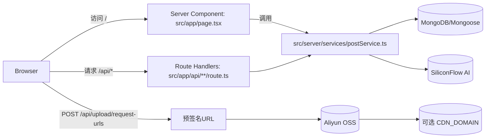

# 今日红书 TodayRedNote — Next.js 全栈重构技术文档（求职向）

> 本文档面向面试/技术评审：重点展示“**全栈架构升级**、**信息流性能优化**、**创作链路闭环**、**工程化上线**、**安全鉴权**”等能力，并给出明确的代码落点，方便复盘与追问。

---

## 目录

- 1. 项目概览与亮点
- 2. 整体架构与技术栈
- 3. 目录结构与分层设计
- 4. 路由与接口地图（技术路线图）
- 5. 部署与运维（ECS + GitHub Actions + PM2）
- 6. 首页信息流（瀑布流/虚拟滚动/SSR/下拉刷新/推荐）
- 7. 笔记详情页（Gallery/轻量渲染/评论/相关推荐）
- 8. 笔记编辑与发布（TipTap/草稿/后台发布/进度横幅）
- 9. 个人主页（瀑布流复用/分页/操作能力）
- 10. 鉴权与安全（bcrypt + JWT HttpOnly Cookie）
- 11. 全局状态管理与数据一致性（Zustand + React Query）
- 12. 工程化与质量保障（Monorepo types / 格式化 / 规范）
- 13. 迁移升级里程碑（git 证据链）
- 14. 总结：可写入简历的项目贡献

---

# 1. 项目概览与亮点

## 1.1 项目定位

今日红书是一个“小红书风格”的移动端内容社区 Demo，覆盖从浏览到创作的完整闭环：

- 信息流：双列瀑布流、虚拟滚动、无限加载、下拉刷新、首屏 SSR
- 详情页：大图 Gallery、正文轻量渲染、评论区、相关推荐
- 创作链路：TipTap 富文本、图片上传（OSS 预签名直传）、本地+云端草稿、后台发布任务、发布进度横幅
- 个人主页：作品流复用瀑布流与分页、编辑/删除能力
- 推荐：用户画像（行为权重）+ AI 提取的 tags/topic
- 工程化：GitHub Actions → 阿里云 ECS 自动部署，PM2 守护进程

## 1.2 “求职向”核心亮点（可直接复述）

- **全栈重构能力**：从 Vite + Express 前后端分离升级到 Next.js App Router 全栈一体，服务端领域逻辑沉到 `src/server/services/*` 统一复用。
- **信息流性能能力**：双列瀑布流 + 虚拟滚动（动态高度测量 + 二分查找裁剪），并做了滚动位置/高度缓存，返回首页不跳动。
- **缓存体系设计**：页面 ISR（`revalidate=60`）+ API Cache-Control（`s-maxage`/`stale-while-revalidate`）+ 服务内存首屏缓存（TTL + 失效），兼顾性能与一致性。
- **创作链路闭环**：草稿自动保存（5s）+ 离线可用 + 云端同步（含冲突处理）+ 后台发布（全局发布器）+ 发布横幅反馈。
- **上线闭环**：Actions 构建产物上传、服务器端安装 prod 依赖、PM2 reload/startOrReload，幂等可重试。

---

# 2. 整体架构与技术栈

## 2.1 架构升级：从前后端分离到 Next 全栈

升级前（旧文档）为典型 SPA + 独立后端：

- React + Vite（CSR）
- Express API + MongoDB + JWT
- 前后端两套部署

升级后（当前仓库）为 Next 全栈一体：

- **页面渲染**：Next.js App Router，首页/详情页支持 SSR/ISR
- **API**：Route Handlers（`src/app/api/**/route.ts`）
- **服务端领域层**：`src/server/services/*`（被 SSR 与 API 复用）
- **数据层**：Mongoose models + 连接复用

## 2.2 技术栈清单（按职责）

- 框架：Next.js `16.0.10`（App Router） + React `19.2.1` + TypeScript
- UI：TailwindCSS 4 + Radix UI + lucide-react
- 数据请求：Axios（`src/lib/api.ts`）
- 请求缓存：@tanstack/react-query（Provider：`src/components/providers/Providers.tsx`）
- 状态管理：Zustand（home/auth/publishing/profilePosts）
- 富文本：TipTap（`src/features/post/edit/*`）
- DB：MongoDB + Mongoose（连接：`src/server/db.ts`）
- 鉴权：bcrypt（加盐哈希）+ JWT（HttpOnly Cookie）
- 存储：阿里云 OSS（预签名直传）+ 可选 CDN 重写
- AI：SiliconFlow（OpenAI SDK 兼容），用于 topic/tags 抽取

## 2.3 关键数据流（简化）

---

# 3. 目录结构与分层设计

## 3.1 目录结构

- `src/app/*`：页面与 Route Handlers
- `src/features/*`：以业务域组织 UI（home/post/profile/auth）
- `src/components/*`：通用组件（Providers、WaterfallContainer、ui primitives）
- `src/hooks/*`：业务 hook（下拉刷新、草稿自动保存、上传、评论、相关笔记等）
- `src/stores/*`：Zustand stores
- `src/server/*`：服务端领域层（models/services/utils/db/auth）
- `packages/types`：monorepo 共享类型与常量（`@today-red-note/types`）

## 3.2 分层边界与“真相源”

- **UI/交互层**（`src/features` / `src/components`）：只负责渲染、交互、调用 hook
- **数据访问层**（`src/app/api/**`）：只负责鉴权、参数校验、调用 service、返回 Response
- **业务领域层**（`src/server/services/*`）：聚合核心业务（分页、推荐、AI 抽取、草稿、鉴权等），是核心“真相源”
- **数据模型层**（`src/server/models/*`）：Mongoose schema

这样做的收益：

- SSR 与 API 调用同一套 service，避免“双实现漂移”
- 可单独对 service 做单元测试（未来扩展）

---

# 4. 路由与接口地图（技术路线图）

## 4.1 页面路由（App Router）

- `/`：首页信息流（SSR/ISR）
  - `src/app/page.tsx`
  - `src/features/home/ui/HomePageClient.tsx`
- `/post/[id]`：笔记详情（SSR + metadata）
  - `src/app/post/[id]/page.tsx`
  - `src/features/post/ui/PostDetailPageClient.tsx`
- `/createPost`：新建笔记（草稿自动保存、后台发布）
  - `src/app/createPost/page.tsx`
  - `src/features/post/ui/PostEditorClient.tsx`
- `/editPost/[id]`：编辑笔记（SSR 获取 initialPost）
  - `src/app/editPost/[id]/page.tsx`
  - `src/features/post/ui/PostEditorClient.tsx`
- `/profile`：个人主页
  - `src/app/profile/page.tsx`
  - `src/features/profile/ui/ProfilePageClient.tsx`
- `/login`：登录页
  - `src/app/login/page.tsx`

## 4.2 API 路由（Route Handlers）

- Posts
  - `GET /api/posts`：信息流分页（登录=个性化，未登录=公共流）
  - `POST /api/posts`：创建笔记
  - `GET /api/posts/mine`：获取当前用户作品
  - `GET /api/posts/[id]`：详情
  - `PUT /api/posts/[id]`：更新（作者权限）
  - `DELETE /api/posts/[id]`：删除（作者权限）
  - `GET /api/posts/[id]/comments`：评论列表
  - `POST /api/posts/[id]/comments`：创建评论
  - `GET /api/posts/[id]/related`：相关推荐分页

- Auth
  - `POST /api/auth/register`
  - `POST /api/auth/login`
  - `GET /api/auth/me`
  - `POST /api/auth/logout`

- Drafts
  - `GET /api/drafts`：获取当前用户草稿
  - `POST /api/drafts`：创建草稿
  - `PUT /api/drafts/[id]`：更新草稿
  - `DELETE /api/drafts/[id]`：删除草稿

- Upload
  - `POST /api/upload/request-urls`：生成 OSS 预签名上传 URL

---

# 5. 部署与运维（ECS + GitHub Actions + PM2）

## 5.1 本地开发/构建

- `pnpm dev`：先构建 `@today-red-note/types` 再 `next dev`
- `pnpm build`：构建 types + `next build`
- `pnpm start`：`next start`

## 5.2 环境变量（以 `.env.example` 为准）

- DB：`MONGODB_URI`
- 鉴权：`JWT_SECRET`
- OSS：`ALI_OSS_REGION / ALI_OSS_ACCESS_KEY_ID / ALI_OSS_ACCESS_KEY_SECRET / ALI_OSS_BUCKET`
- AI：`SILICONFLOW_API_KEY / SILICONFLOW_BASE_URL`
- Public：`.env.example` 中提供 `NEXT_PUBLIC_API_URL`

注意：当前 `src/lib/api.ts` 实际读取的是 `NEXT_PUBLIC_API_BASE_URL || '/api'`。

- 推荐做法：
  - 生产环境同域部署时保持默认 `'/api'`（无需配置）
  - 如需跨域，可在环境变量中统一为 `NEXT_PUBLIC_API_BASE_URL`（并同步更新 `.env.example`）

另外：服务端图片处理支持 `CDN_DOMAIN`（用于把 OSS 直链重写到 CDN 域名）

- `src/server/utils/imageUtils.ts`：`process.env.CDN_DOMAIN`

## 5.3 CI/CD：GitHub Actions → ECS

工作流：`.github/workflows/deploy.yml`

- 触发：push 到 `main`
- 构建：Node 20 + pnpm + `pnpm build`（构建阶段注入 secrets）
- 产物上传：只同步 `.next public package.json pnpm-lock.yaml next.config.ts ecosystem.config.js`
- 服务器侧脚本：
  - `pnpm install --prod`
  - `pm2 reload today-red-note || pm2 start ecosystem.config.js`
  - `pm2 startOrReload ecosystem.config.js`

说明：这里“reload → start → startOrReload”带来更强的幂等性（进程不存在也能启动）。

## 5.4 进程守护：PM2

配置：`ecosystem.config.js`

- 进程名：`today-red-note`
- 启动：`pnpm start`
- 策略：`autorestart` + `max_memory_restart: '1G'`

---

# 6. 首页信息流（瀑布流/虚拟滚动/SSR/下拉刷新/推荐）

## 6.1 SSR/ISR 首屏

- 入口：`src/app/page.tsx`
- 策略：`export const revalidate = 60`
- 数据：服务端调用 `postService.getPosts()` 获取首屏 posts 与 pagination 下发

收益：

- 更快的首屏体验（服务端直出 HTML）
- 可被 ISR 缓存命中

## 6.2 SSR 数据注入 store（解决重复请求与回跳）

实现：`src/features/home/ui/HomePageClient.tsx`

- 首次挂载把 `initialPosts` 注入 `homeStore`
- store 维护：posts、cursor、滚动位置、卡片高度等
- 返回首页时：恢复 scrollTop，瀑布流布局不“从零测量”，减少跳动

## 6.3 双列瀑布流 + 虚拟滚动（核心性能点）

组件：`src/components/ui/WaterfallContainer.tsx`

- 布局：贪心分列（放入更短的一列）
- 虚拟化：
  - 维护每列 items 的累计偏移
  - 二分查找可见区 start/end
  - paddingTop/paddingBottom 占位维持真实滚动高度
- 动态高度：
  - `ResizeObserver` 监听真实高度
  - 对细小抖动做阈值过滤，避免高频 reflow

## 6.4 下拉刷新（移动端手感 + 性能）

实现：`src/hooks/usePullToRefresh.ts`

- 只在 `scrollTop <= 0` 时启用
- 手感：阻尼、最大距离、阈值
- 性能：拖动过程使用 `requestAnimationFrame` + 直接 DOM 更新（避免 setState 抖动）

## 6.5 个性化推荐（画像 + AI tags/topic）

核心文件：

- `src/server/services/postService.ts`：个性化 feed + fallback 补齐
- `src/server/services/userProfileService.ts`：用户画像（兴趣权重更新）

关键机制：

- 画像：根据 view/like/share/collect 等行为更新 tag 权重
  - 学习率：`LEARNING_RATE = 0.05`
  - 上限：`MAX_INTERESTS = 50`
- 推荐：按兴趣 tags 召回，不足时回退到时间流
- 去重：前端传 `excludeIds`，后端限制最大数量避免 URL 过长

## 6.6 多层缓存体系（首屏性能与 DB 压力）

- 页面 ISR：`src/app/page.tsx` 的 `revalidate=60`
- API Header 缓存：`GET /api/posts` 首屏公共流返回 `Cache-Control: s-maxage=60, stale-while-revalidate=300`
- 服务内存缓存：`postService` 中 firstPageCache（TTL 60s），并在 create/update/delete 时失效

---

# 7. 笔记详情页（Gallery/轻量渲染/评论/相关推荐）

## 7.1 详情 SSR 与动态 metadata

- 页面：`src/app/post/[id]/page.tsx`
- `generateMetadata()`：根据 post 内容生成 title/description

## 7.2 大图 Gallery（snap-x）

- 组件：`src/features/post/components/PostDetailItem.tsx`
- 技术点：
  - 横向滚动 `snap-x snap-mandatory`
  - 监听 `scrollLeft/clientWidth` 计算 activeIndex
  - 图片比例与首页统一：`getAspectRatio(coverRatio)`

## 7.3 正文轻量渲染（非 TipTap Readonly）

- 方式：`dangerouslySetInnerHTML`
- 取舍：阅读场景优先减轻运行时与 hydration 成本，让编辑器只在编辑页加载

## 7.4 评论区（鉴权 + 校验 + 计数维护）

- API：`src/app/api/posts/[id]/comments/route.ts`
  - Zod 校验长度
  - 未登录返回 401
  - 创建评论后 `$inc: { commentCount: 1 }`
- 前端：`PostDetailItem.tsx`
  - 未登录评论跳转：`/login?from=<pathname>`

## 7.5 相关推荐（IntersectionObserver + 分页 + 去重）

- 客户端：`src/features/post/ui/PostDetailPageClient.tsx`
  - `IntersectionObserver` 触发加载更多
  - `rootMargin = 2000px` 提前加载避免用户等待
  - 支持 query param `disableRecommendations=true`
- 数据：`src/features/post/hooks/useRelatedPosts.ts` + `GET /api/posts/[id]/related`

---

# 8. 笔记编辑与发布（TipTap/草稿/后台发布/进度横幅）

## 8.1 编辑器封装：TipTap + Toolbar

- 编辑器：`src/features/post/edit/RichTextEditor.tsx`
  - StarterKit + Placeholder + Link
  - `ref` 暴露 editor instance
- 工具栏：`src/features/post/edit/RichTextToolbar.tsx`
  - undo/redo、bold、heading、list、quote、link 等

## 8.2 图片上传：OSS 预签名直传 + 前端压缩

- 预签名 URL：`POST /api/upload/request-urls`（`src/app/api/upload/request-urls/route.ts`）
- 前端上传：`src/lib/postUtils.ts`（`uploadImages`）
  - 可集成压缩、并发上传、进度回调

服务端图片 URL 处理：`src/server/utils/imageUtils.ts`

- 强制 https，避免 Mixed Content
- 可选 `CDN_DOMAIN`：将 OSS 域名重写到 CDN
- 自动拼接 `x-oss-process`（resize/quality/format）

## 8.3 草稿系统：本地 + 云端同步（含离线）

- Hook：`src/hooks/useDraftAutoSave.ts`
  - 自动保存间隔：`AUTO_SAVE_INTERVAL = 5000`
  - 使用 `contentRef` 给定时器读取最新内容，避免闭包陈旧
  - 先存本地，再在线同步云端
  - 新图片在在线时可先上传，url 合并进 `uploadedImages`
- 存储层：`src/lib/draftStorage.ts`
  - localStorage key：`post_draft`
  - 云端：`GET/POST/PUT/DELETE /api/drafts`
  - 冲突策略：云端 `updatedAt` 更新则覆盖本地（并回写本地副本）

编辑器 UI 提示：`src/features/post/ui/PostEditorClient.tsx`

- 在线：Cloud 图标
- 离线：CloudOff + “待同步”

## 8.4 后台发布：全局发布器（跨页面不中断）

动机：用户发布后通常会回到首页继续浏览，如果发布逻辑绑在编辑页组件上，页面跳转会中断请求。

你的实现：

- `PostEditorClient`（新建模式）只负责“设置发布任务 + 跳转首页”
  - `usePublishingStore.startPublishing(coverImage)`
  - `usePublishingStore.getState().setPublishingTask(...)`
- `GlobalPublisher` 常驻执行发布任务：`src/components/features/GlobalPublisher.tsx`
  - 监听 store：当 `publishingTask` 存在且 `status==='uploading'` 时触发
  - 调用 `useCreatePost()` 完成真正发布
  - 成功后清理本地/云端草稿（`draftStorage.clearLocal/deleteCloud`）

## 8.5 发布进度横幅（全局反馈）

- Store：`src/stores/publishingStore.ts`
  - 状态：idle/uploading/success/error
  - 进度：progress（0-100）
  - 成功后记录 `postId`
- UI：`src/features/post/components/PublishingBanner.tsx`
  - 展示封面、进度、结果
  - 点击可跳转到新发布的笔记

---

# 9. 个人主页（瀑布流复用/分页/操作能力）

- 页面：`src/app/profile/page.tsx`
- UI：`src/features/profile/ui/ProfilePageClient.tsx`
- 状态：`src/stores/profilePostsStore.ts`

能力点：

- 作品流复用 `WaterfallContainer`，并保留滚动位置
- Tab 切换（notes/saved/liked）组织内容
- 登录态驱动：未登录可引导登录；已登录支持退出登录

---

# 10. 鉴权与安全（bcrypt + JWT HttpOnly Cookie）

## 10.1 密码安全：bcrypt 加盐哈希

模型：`src/server/models/userModel.ts`

- `pre('save')`：`bcrypt.genSalt(10)` + `bcrypt.hash()`
- password 字段 `select: false`，默认查询不返回
- `comparePassword()`：`bcrypt.compare()`

## 10.2 JWT 会话：HttpOnly Cookie

- 登录：`src/app/api/auth/login/route.ts`
- 注册：`src/app/api/auth/register/route.ts`
- 会话查询：`src/app/api/auth/me/route.ts`
- 退出：`src/app/api/auth/logout/route.ts`

关键点：

- token 通过 HttpOnly cookie 下发，前端 JS 不可读，降低 XSS 风险
- API 侧通过 `getSession()`（服务端读取 cookie 并验签）判断登录态

---

# 11. 全局状态管理与数据一致性（Zustand + React Query）

## 11.1 分工原则

- React Query：负责“请求缓存/重试/请求态”，适合列表/详情/评论等
- Zustand：负责“跨页面业务状态”，适合：
  - 首页信息流的滚动/高度/去重集合
  - 发布任务（后台发布）
  - 登录态（用户信息、是否已初始化）

## 11.2 典型 store

- 首页：`src/stores/homeStoreContext.tsx`
  - 解决“返回首页不丢状态”的体验问题
- 发布：`src/stores/publishingStore.ts`
  - 解决“跳转页面发布不中断”的一致性问题
- 鉴权：`src/stores/auth.ts`
  - Providers 初始化时拉取 `/api/auth/me`，统一登录态

---

# 12. 工程化与质量保障

- Monorepo 类型共享：`packages/types` → `@today-red-note/types`（workspace:\*）
- 代码规范：Prettier + ESLint
  - `lint-staged`：提交前格式化与修复
  - Husky：git hooks
- Next 配置：
  - `next.config.ts`：remote image patterns、`serverExternalPackages: ['mongoose']`（降低 server bundle 问题）

---

# 13. 迁移升级里程碑（git 证据链）

基于 `git log --oneline` 的关键节点（可用于面试“做了什么/怎么做/为什么”）：

- `52bf925`：迁移 next-app 至根目录、删除 client/server（统一工程结构）
- `66e6d12`：初步实现首页 SSR（首屏渲染策略落地）
- `11deea3`：迁移笔记编辑页与草稿功能（创作链路核心）
- `09f7b07`：配置 GitHub Actions 自动化部署（上线闭环）
- `636891a`：SSR 同时下发 posts 与 pagination，并注入 homeStore（避免重复请求/回跳稳定）
- `c4cf964`：避免首屏全部图片 eager + preconnect 图片域名（关键路径优化）
- `5da77b2`：修复推荐模式切换时游标双重包装导致服务崩溃（线上稳定性修复）

---

# 14. 总结：可写入简历的项目贡献

你可以把下面内容精炼成简历 bullet（建议每条 1 行，含“技术点 + 结果/价值”）：

- 完成 **Vite+Express → Next.js 全栈**重构：统一路由、API 与服务层，沉淀 `src/server/services` 作为业务真相源，SSR 与 API 复用同一套逻辑。
- 实现内容社区核心信息流：双列瀑布流 + 虚拟滚动（动态高度测量、二分查找裁剪、overscan），并缓存滚动/高度，返回首页无跳动。
- 构建多层缓存体系：页面 ISR（60s）+ API CDN 缓存头 + 服务首屏内存缓存（TTL + 失效），兼顾性能与一致性。
- 打通创作链路：TipTap 富文本、OSS 预签名直传、草稿本地+云端同步（含离线与冲突处理），并通过全局发布器实现“后台发布不中断”。
- 搭建 GitHub Actions 自动部署至阿里云 ECS：产物 rsync、服务器 prod 依赖安装、PM2 守护与幂等重载，形成可复用上线闭环。

---

> 文档维护建议：后续可以把“接口示例请求/响应”“关键业务时序图”“性能数据（LCP/CLS/内存）”补充到本文件末尾，进一步提升展示力。
