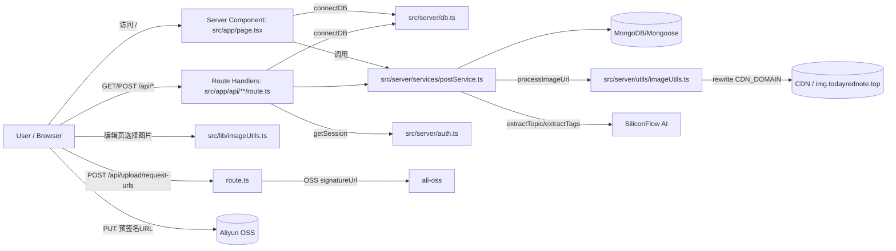
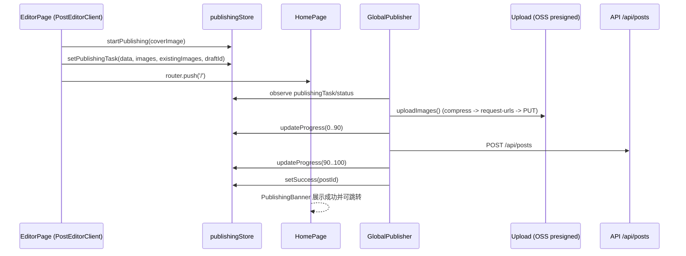

# 今日红书 TodayRedNote — Next.js 全栈专业技术文档（升级改造版）

> 目标读者：技术评审/架构复盘/面试深挖。
>
> 本文档在既有“求职向文档”的基础上，进一步补齐：**代码级落点**、**端到端链路时序**、**性能与缓存体系**、**部署运维闭环**、以及**迁移升级的工作量证据链（git）**。

---

## 目录

- 1. 项目一句话概括与价值
- 2. 架构升级总览（Vite + Express → Next 全栈）
- 3. 整体架构与技术栈
- 4. 目录结构与分层边界（真相源）
- 5. 路由与 API 地图（含 DTO/分页游标协议）
- 6. 部署与运行（ECS + GitHub Actions + PM2）
- 7. 首页信息流
  - 7.1 双列瀑布流（设计理念 + 视觉与业务目标）
  - 7.2 虚拟滚动（动态高度测量 + 二分裁剪）
  - 7.3 页面切换不重载 + 恢复滚动位置
  - 7.4 首页 SSR/ISR（首屏与缓存）
  - 7.5 下拉刷新
  - 7.6 用户画像与个性化推荐
- 8. 笔记详情页
  - 8.1 Gallery 大图（小红书式叙事与空间记忆）
  - 8.2 正文轻量渲染（非 TipTap Readonly）
  - 8.3 评论区
  - 8.4 相关推荐（长驻留时间策略）
- 9. 笔记编辑与发布
  - 9.1 TipTap 富文本编辑器（封装与扩展）
  - 9.2 草稿：本地 + 云端同步 + 离线编辑
  - 9.3 图片：压缩、预签名直传、URL 重写与多质量策略
  - 9.4 发布后跳转首页 + 进度横幅（后台发布不中断）
- 10. 个人主页
  - 10.1 瀑布流复用
  - 10.2 跳转详情页、二次编辑与删除
- 11. 鉴权与安全
  - 11.1 密码加盐哈希
  - 11.2 JWT + HttpOnly Cookie 会话
  - 11.3 典型安全边界与注意事项
- 12. 其他：全局状态管理与数据一致性
- 13. 迁移升级工作量与里程碑（git 证据链）
- 14. 总结：可复用的工程方法论与下一步规划

---

# 1. 项目一句话概括与价值

今日红书是一个“小红书风格”的移动端内容社区全栈应用：以**双列瀑布流信息流**承载内容消费，以**大图详情 + 评论 + 相关推荐**提高停留时长，以**TipTap 创作 + 草稿 + 图片直传 + 后台发布**打通创作闭环，并通过 **Next.js App Router** 将页面、API、领域服务统一在一个工程内，实现更一致的工程边界、更强的可维护性与更完整的部署闭环。

---

# 2. 架构升级总览（Vite + Express → Next 全栈）

## 2.1 升级前（旧形态）

- **前端**：React + Vite（CSR/SPA）
- **后端**：Express API（独立服务）
- **部署**：前后端分离（典型为 Vercel / Railway 等），跨域与转发需要额外配置
- **问题与成本**：
  - 首屏完全 CSR：SEO 与首屏体验较弱
  - 前后端分仓/分进程：部署链路长，环境变量与版本对齐成本高
  - 业务逻辑易出现“双实现漂移”（SSR/页面逻辑与 API 逻辑无法天然复用）

## 2.2 升级后（现形态）

- **Next.js App Router 全栈一体**：页面、Route Handlers、服务端领域层共存
- **同构复用**：`src/server/services/*` 作为核心业务“真相源”，供 SSR 与 API 复用
- **部署闭环**：GitHub Actions 自动构建并发布至阿里云 ECS，PM2 守护进程

---

# 3. 整体架构与技术栈

## 3.1 技术栈（按职责划分）

- **框架与运行时**
  - Next.js `16.0.10`（App Router）
  - React `19.2.1`
  - TypeScript
- **UI 与样式**
  - TailwindCSS 4
  - Radix UI
  - lucide-react
- **数据请求与缓存**
  - Axios：`src/lib/api.ts`
  - React Query：`src/components/providers/Providers.tsx`
- **状态管理**
  - Zustand：auth / homeStore / publishing / profilePosts 等
- **富文本**
  - TipTap：`src/features/post/edit/*`
- **数据库**
  - MongoDB + Mongoose
  - 连接复用：`src/server/db.ts`
- **鉴权**
  - bcrypt：密码加盐哈希
  - JWT：HttpOnly Cookie
  - 服务端会话读取：`src/server/auth.ts`
- **对象存储与图片链路**
  - 阿里云 OSS：预签名直传
  - 可选 CDN 域名重写：`CDN_DOMAIN`
- **AI 能力（标签/话题抽取）**
  - SiliconFlow（OpenAI SDK 兼容）：`src/server/services/aiService.ts`

## 3.2 技术路线图（端到端数据流）

---

# 4. 目录结构与分层边界（真相源）

## 4.1 目录结构

- `src/app/*`：页面与 Route Handlers（API）
- `src/features/*`：按业务域组织 UI（home/post/profile/auth）
- `src/components/*`：跨业务通用组件（Providers、WaterfallContainer、Toast、BottomNav）
- `src/hooks/*`：可复用业务 Hook（下拉刷新、草稿自动保存、发布/评论等）
- `src/stores/*`：Zustand stores
- `src/server/*`：服务端领域层（models/services/utils/db/auth）
- `packages/types`：Monorepo 共享类型与常量（`@today-red-note/types`）

## 4.2 分层原则与收益

- **UI/交互层（features/components）**：只负责渲染与交互，不直接写业务规则
- **API 层（Route Handlers）**：只负责
  - 鉴权（`getSession`）
  - 参数解析与校验（如 comments 的 Zod）
  - 调用服务层，返回 Response（必要时加缓存头）
- **服务层（src/server/services）**：
  - 业务聚合与编排（推荐阶段切换、缓存失效、AI 抽取、分页游标协议）
  - SSR 与 API 共用一套逻辑，避免“双实现漂移”
- **模型层（src/server/models）**：仅描述数据结构与约束

---

# 5. 路由与 API 地图（含 DTO/分页游标协议）

## 5.1 页面路由（App Router）

- **`/` 首页信息流**
  - `src/app/page.tsx`（Server Component：SSR + `revalidate`）
  - `src/features/home/ui/HomePageClient.tsx`（Client：瀑布流/虚拟滚动/刷新/无限加载）

- **`/post/[id]` 笔记详情**
  - `src/app/post/[id]/page.tsx`（SSR + `generateMetadata`）
  - `src/features/post/ui/PostDetailPageClient.tsx`

- **`/createPost` 新建笔记**
  - `src/app/createPost/page.tsx`（支持 query `topic` 预填充）
  - `src/features/post/ui/PostEditorClient.tsx`

- **`/editPost/[id]` 编辑笔记**
  - `src/app/editPost/[id]/page.tsx`（SSR 获取 initialPost）

- **`/profile` 个人主页**
  - `src/app/profile/page.tsx`
  - `src/features/profile/ui/ProfilePageClient.tsx`

- **`/login` 登录页**
  - `src/app/login/*`（略）

## 5.2 API 路由（Route Handlers）

### 5.2.1 Auth

- `POST /api/auth/register`
- `POST /api/auth/login`
- `GET /api/auth/me`
- `POST /api/auth/logout`

关键文件：

- `src/app/api/auth/*/route.ts`
- `src/server/services/auth.ts`
- `src/server/auth.ts`（服务端读取 Cookie/Authorization）

### 5.2.2 Posts

- `GET /api/posts`
  - 未登录：公共信息流 `postService.getPosts()`
  - 已登录：个性化推荐 `postService.getPersonalizedFeed()`
  - 首屏公共流设置缓存头：`Cache-Control: public, s-maxage=60, stale-while-revalidate=300`

- `POST /api/posts`：创建笔记（需登录）
- `GET /api/posts/[id]`：详情（登录时异步写入画像行为）
- `PUT /api/posts/[id]`：更新（作者权限）
- `DELETE /api/posts/[id]`：删除（作者权限 + OSS 清理 + 首屏缓存失效）
- `GET /api/posts/mine`：获取当前用户作品流
- `GET /api/posts/[id]/comments`：评论列表
- `POST /api/posts/[id]/comments`：发表评论（Zod 校验 + commentCount 维护）
- `GET /api/posts/[id]/related`：相关推荐（cursor + excludeIds）

### 5.2.3 Drafts

- `GET /api/drafts`：获取当前用户草稿（每个用户 1 份）
- `POST /api/drafts`：创建/保存草稿（upsert）
- `PUT /api/drafts/[id]`：更新草稿
- `DELETE /api/drafts/[id]`：删除草稿

### 5.2.4 Upload

- `POST /api/upload/request-urls`
  - 返回多文件的 `uploadUrl`（预签名 PUT）和 `publicUrl`
  - 强制校验 `Content-Type` 与文件类型一致
  - objectName 规划：`{userId}/{uuid}_{safeFilename}`
  - 缓存策略：`Cache-Control: public, max-age=31536000`（1 年）

## 5.3 DTO 与分页游标协议（Cursor）

- DTO：`src/types/posts.ts`
  - `CreatePostDto` / `UpdatePostDto`
- Cursor：base64(JSON)
  - 公共时间流：`{ createdAt, _id }`
  - 个人作品流：`{ updatedAt, _id }`
  - 个性化/相关推荐三阶段：`{ phase, createdAt, _id, innerCursor }`
- 编解码：`src/server/utils/cursorUtils.ts`

---

# 6. 部署与运行（ECS + GitHub Actions + PM2）

## 6.1 本地开发

- 安装依赖
  - `pnpm install`
- 开发
  - `pnpm dev`
  - 先构建 `packages/types`：`pnpm --filter @today-red-note/types run build`
  - 再启动 `next dev`

## 6.2 生产构建与启动

- `pnpm build`：构建 types + `next build`
- `pnpm start`：`next start`

## 6.3 环境变量

以 `.env.example` 为准（重点字段）：

- `MONGODB_URI`
- `JWT_SECRET`
- `ALI_OSS_REGION / ALI_OSS_ACCESS_KEY_ID / ALI_OSS_ACCESS_KEY_SECRET / ALI_OSS_BUCKET`
- `SILICONFLOW_API_KEY / SILICONFLOW_BASE_URL`
- 可选：`CDN_DOMAIN`

注意：

- `src/lib/api.ts` 实际读取的是 `NEXT_PUBLIC_API_BASE_URL || '/api'`
- `.env.example` 目前给的是 `NEXT_PUBLIC_API_URL`，建议在生产环境统一为 `NEXT_PUBLIC_API_BASE_URL` 或保持同域默认 `'/api'`（无需配置）。

## 6.4 CI/CD（GitHub Actions → ECS）

工作流文件：`.github/workflows/deploy.yml`

关键步骤：

- 触发：push `main`
- Build：Node 20 + pnpm，注入 secrets，`pnpm build`
- 部署：`easingthemes/ssh-deploy` 将 `.next public package.json pnpm-lock.yaml next.config.ts ecosystem.config.js` 同步到 ECS
- 服务器侧：
  - `pnpm install --prod`
  - `pm2 reload today-red-note || pm2 start ecosystem.config.js`
  - `pm2 startOrReload ecosystem.config.js`

## 6.5 进程守护（PM2）

- 配置：`ecosystem.config.js`
- 进程名：`today-red-note`
- 启动命令：`pnpm start`
- 策略：`autorestart`、`max_memory_restart: '1G'`

---

# 7. 首页信息流

首页的核心目标是：在移动端长列表场景下做到「**像原生 App 一样顺滑**」——视觉一致、滚动稳定、加载及时、返回不跳动。

## 7.1 双列瀑布流（设计理念 + 视觉与业务目标）

### 7.1.1 为什么是双列瀑布流

双列瀑布流是内容社区的事实标准（微信视频号/抖音/小红书等均采用类似布局），原因在于：

- **单位屏幕面积承载的信息密度更高**：两列可显著提升内容曝光，利于“多看多点”
- **强视觉驱动**：图像优先的内容形态，更适配推荐信息流
- **更好的探索效率**：用户无需频繁停顿，快速滑动即可完成“候选集筛选”

### 7.1.2 实现落点

- UI 入口：`src/features/home/ui/HomePageClient.tsx`
- 核心容器：`src/components/ui/WaterfallContainer.tsx`
- 卡片：`src/features/post/components/PostCard.tsx`
- 预估高度：`src/lib/postUtils.ts -> calculatePostHeight()`

## 7.2 虚拟滚动（动态高度测量 + 二分裁剪）

### 7.2.1 设计挑战

瀑布流与普通列表不同：

- 每个卡片高度不同（图片比例、正文预览长度）
- 卡片真实高度需要渲染后才能拿到
- 若完整渲染 200+ 卡片，会产生巨量 DOM 与重排，移动端掉帧明显

### 7.2.2 方案概述

`WaterfallContainer` 的核心策略：

- **两列贪心分配**：总是把下一个卡片放到当前更短的那一列（近似最优）
- **高度来源**：
  - 优先使用已测量高度 `measuredHeights[key]`
  - 否则使用 `estimateHeight(item)`
- **虚拟化裁剪**：
  - 计算可视窗口 `visibleTop/visibleBottom`（含 `overscan` 缓冲）
  - 对每列用 **二分查找** 找到 start/end
  - 用 `paddingTop/paddingBottom` 占位维持滚动条真实高度
- **动态高度测量**：
  - `ResizeObserver` 监听真实高度
  - 高度变化阈值 `< 1px` 不更新，避免浮点抖动导致重渲染循环

关键代码：

- `src/components/ui/WaterfallContainer.tsx`
  - `binarySearch()`
  - `MeasuredItem + ResizeObserver`

### 7.2.3 预估高度策略（减少首屏跳动）

`calculatePostHeight` 在 SSR/首次渲染时尽量给出接近真实的高度：

- 图片高度：由 `coverRatio`（portrait 3:4 / landscape 4:3）+ 列宽计算
- 文本高度：按“视觉宽度”估算（中文字符权重更大），限制最多两行

文件：`src/lib/postUtils.ts`

## 7.3 页面切换不重载 + 恢复滚动位置

### 7.3.1 目标

- 从首页进入详情页，再返回首页：
  - 列表不应重新请求首屏
  - 滚动位置应恢复
  - 瀑布流布局不应从零测量导致“跳动/闪白”

### 7.3.2 实现

- 状态容器：`src/stores/homeStoreContext.tsx`
  - `posts / scrollPosition / postHeights / viewedPostIds`
- 首页挂载：
  - SSR 首屏注入 store（只在 store 为空时注入，避免覆盖返回态）
  - `scrollContainerRef` 恢复 `scrollTop`
  - `postHeights` 作为 `WaterfallContainer.initialHeights`，减少二次测量成本

对应代码：`src/features/home/ui/HomePageClient.tsx`

## 7.4 首页 SSR/ISR（首屏与缓存）

### 7.4.1 SSR 入口

`src/app/page.tsx`：

- `export const revalidate = 60`（ISR 60s）
- `connectDB()`
- `postService.getPosts(FETCH_LIMIT)`

### 7.4.2 多层缓存体系

- **页面层（ISR）**：首屏 60s 重新验证
- **API 层（CDN 缓存头）**：`GET /api/posts` 未登录首屏
  - `Cache-Control: public, s-maxage=60, stale-while-revalidate=300`
- **服务层（内存缓存）**：`postService.getPosts()`
  - `FIRST_PAGE_CACHE_TTL = 60s`
  - 发布/删除时 `invalidateFirstPageCache()`

这三层叠加的价值：

- 首屏请求路径更短（减少 DB 压力）
- CDN/边缘节点能提供稳定吞吐
- 仍能在可控时间窗口内保持“足够新鲜”的内容

## 7.5 下拉刷新

目标是做出原生 App 的“跟手感”与性能：

- 仅在 `scrollTop <= 0` 时生效
- `touchmove` 阶段用 `requestAnimationFrame` 节流
- 通过直接操作 DOM（修改指示器高度/旋转）避免 React 高频重渲染

实现：

- Hook：`src/hooks/usePullToRefresh.ts`
- 指示器：`src/components/ui/PullToRefreshIndicator.tsx`

## 7.6 用户画像与个性化推荐

### 7.6.1 画像模型

- 模型：`src/server/models/userProfileModel.ts`
- 服务：`src/server/services/userProfileService.ts`

画像内容：

- `interests[]`：tag 权重（0~1），带 `lastUpdated`
- `behaviorHistory[]`：行为日志（view/like/collect/share）

### 7.6.2 行为采集（异步，不阻塞接口）

- 详情接口 `GET /api/posts/[id]` 在登录态下：
  - `userProfileService.trackUserBehavior(currentUserId, id, 'view').catch(...)`

### 7.6.3 推荐策略

- API：`GET /api/posts`
  - 登录：`postService.getPersonalizedFeed()`
  - 未登录：`postService.getPosts()`

个性化推荐的核心是**分阶段游标**：

- phase `profile`：按兴趣 tag 召回
- phase `fallback`：不足则补齐时间流
- cursor 通过 `{ phase, innerCursor }` 统一封装，避免客户端复杂分支

---

# 8. 笔记详情页

## 8.1 Gallery 大图（小红书式叙事与空间记忆）

### 8.1.1 设计理念

详情页大图 Gallery 的目标不仅是“展示图片”，更是建立用户的 **空间记忆（spatial memory）**：

- 用户从信息流点击进入详情页后，第一眼看到的是与封面一致的图片内容
- 横向滑动（snap）形成连续叙事，减少“我刚才点了什么”的认知成本
- 这是一种典型的 **上下文保持（context preservation）** 与 **注意力锚点（attention anchor）** 设计

### 8.1.2 实现

- 组件：`src/features/post/components/PostDetailItem.tsx`
- CSS：`snap-x snap-mandatory`
- activeIndex：按 `scrollLeft / clientWidth` 推导

## 8.2 正文轻量渲染（非 TipTap Readonly）

阅读场景强调：

- 运行时轻量
- hydration 成本低
- 只在编辑页加载 TipTap（避免详情页为只读模式加载大依赖）

实现：

- `dangerouslySetInnerHTML` 渲染正文
- 样式通过 Tailwind 的 `&_*` 选择器约束标题/列表/引用等排版

文件：`src/features/post/components/PostDetailItem.tsx`

此外：

- 话题按钮点击跳转编辑页并自动预填：`/createPost?topic=...`

## 8.3 评论区

- API：`src/app/api/posts/[id]/comments/route.ts`
  - Zod 校验：长度 1~200
  - 登录态守卫：`getSession()`
  - 写入后 `Post.$inc({ commentCount: 1 })`

- 前端：
  - Query：`src/hooks/usePostComments.ts`（React Query，按需拉取）
  - Mutation：`src/hooks/useAddComment.ts`
  - 未登录评论：跳转 `/login?from=<pathname>`

## 8.4 相关推荐（长驻留时间策略）

### 8.4.1 设计目标

通过“相关推荐”延长驻留时间是内容社区的核心增长手段：

- 用户在读完当前内容后，不需要返回首页就能继续浏览
- 相关推荐越相关，越能形成连续消费

### 8.4.2 客户端加载策略

- 列表页：`PostDetailPageClient` 用 `IntersectionObserver` 触发加载
- `rootMargin = 2000px` 提前加载，降低“到尾部再等”的等待感

### 8.4.3 服务端推荐策略（三阶段）

`postService.getRelatedPosts()`：

- phase `related`：优先同 tags/topic
- phase `profile`：不足则用用户画像补齐
- phase `fallback`：仍不足则用时间流兜底

关键点：

- `excludeIds` 始终包含当前笔记与已展示集合，保证去重

---

# 9. 笔记编辑与发布

## 9.1 TipTap 富文本编辑器（封装与扩展）

- 编辑器：`src/features/post/edit/RichTextEditor.tsx`
  - StarterKit（限制 heading levels 1/2）
  - Link + Placeholder
  - `ref` 暴露 editor instance
- 工具栏：`src/features/post/edit/RichTextToolbar.tsx`
  - undo/redo、标题、列表、引用、链接、清除格式等

## 9.2 草稿：本地 + 云端同步 + 离线编辑

### 9.2.1 设计目标

- 用户随时离开页面不丢稿
- 离线可编辑：至少保存本地文本 + 已上传图片 URL
- 在线自动同步到云端，换设备可恢复

### 9.2.2 实现分层

- 本地/云端存储：`src/lib/draftStorage.ts`
  - localStorage：`post_draft`
  - 云端：`/api/drafts`
  - 云端 404：自动降级为 create

- 自动保存 Hook：`src/hooks/useDraftAutoSave.ts`
  - `AUTO_SAVE_INTERVAL = 5000`
  - `contentRef` 解决闭包陈旧
  - 在线时尝试上传图片并同步云端

- 编辑页集成：`src/features/post/ui/PostEditorClient.tsx`
  - 新建模式启用草稿；编辑模式不启用
  - 顶部显示 online/offline 与保存中/待同步状态

## 9.3 图片：压缩、预签名直传、URL 重写与多质量策略

### 9.3.1 压缩策略（前端）

- `src/lib/imageUtils.ts`
  - Canvas 压缩并导出为 WebP
  - 根据 `IMAGE_QUALITY_CONFIG` 控制 maxWidth/quality/format

### 9.3.2 预签名直传（服务端）

- `POST /api/upload/request-urls`
  - 强制 Content-Type 匹配
  - objectName：`{userId}/{uuid}_{safeName}`
  - 返回 `uploadUrl`（预签名）与 `publicUrl`

### 9.3.3 图片多质量分发（服务端 URL 处理）

- `src/server/utils/imageUtils.ts -> processImageUrl()`
  - 强制 HTTPS
  - 可选 `CDN_DOMAIN` 重写旧 OSS 链接
  - 自动追加 `x-oss-process=image/resize,w_xxx/quality,q_xxx/format,webp`

### 9.3.4 不同区域不同质量

- 首页卡片：`THUMBNAIL`（更小、更快）
- 编辑/详情：`PREVIEW`/`DETAIL`（更清晰）

## 9.4 发布后跳转首页 + 进度横幅（后台发布不中断）

### 9.4.1 为什么需要“后台发布器”

传统方案：发布时停留在编辑页等待上传 → 用户被强制阻塞。

本项目采用：

- 点击发布后**立刻返回首页**继续浏览
- 发布任务由全局发布器在后台执行
- 首页顶部横幅实时展示进度

### 9.4.2 核心实现

- 发布状态 Store：`src/stores/publishingStore.ts`
  - `status: idle/uploading/success/error`
  - `progress: 0~100`
  - `publishingTask`：包含表单数据、图片、草稿 id

- 后台执行器：`src/components/features/GlobalPublisher.tsx`
  - 常驻于 RootLayout
  - 监听 `publishingTask` + `status==='uploading'`
  - 执行 `useCreatePost()`
  - 成功后清理草稿（本地 + 云端）

- 动态加载：`src/components/features/DynamicGlobalPublisher.tsx`
  - `ssr: false`，降低首屏 hydration 负担

- 横幅 UI：`src/features/post/components/PublishingBanner.tsx`
  - 成功 3s 自动关闭
  - 成功后点击跳转新笔记详情

### 9.4.3 发布链路时序图

---

# 10. 个人主页

## 10.1 瀑布流复用

- 页面：`src/features/profile/ui/ProfilePageClient.tsx`
- 作品流 API：`GET /api/posts/mine`
- 复用：`WaterfallContainer` + `PostCard`

## 10.2 跳转详情页、二次编辑与删除

- 从个人页进入详情页：
  - 使用 query `disableRecommendations=true`
  - 目的：个人页的“作品回看”更像单笔记查看，不强制进入相关推荐链路
- 详情页作者操作：
  - 编辑：`/editPost/[id]`
  - 删除：`useDeletePost` 调用 `DELETE /api/posts/[id]`

---

# 11. 鉴权与安全

## 11.1 密码加盐哈希

- 模型：`src/server/models/userModel.ts`
  - `pre('save')`：`bcrypt.genSalt(10)` + `bcrypt.hash()`
  - `password` 字段：`select: false`
  - `comparePassword()`：`bcrypt.compare()`

## 11.2 JWT + HttpOnly Cookie 会话

- 登录：`src/app/api/auth/login/route.ts`
  - 成功后：`response.cookies.set('token', token, { httpOnly, sameSite: 'strict', secure })`
- 注册同理：`register/route.ts`
- 查询会话：`GET /api/auth/me`
  - 服务端 `getSession()` 解析 Cookie
- 退出：`POST /api/auth/logout`（将 cookie maxAge=0）

会话解析：`src/server/auth.ts`

- 优先 Cookie `token`
- fallback 支持 `Authorization: Bearer <token>`（便于调试或特殊客户端）

## 11.3 典型安全边界与注意事项

- **XSS**：
  - token 只存 HttpOnly Cookie，前端 JS 不可读
  - 正文渲染使用 `dangerouslySetInnerHTML`，在生产建议补充 HTML 白名单/消毒（当前 Demo 侧重功能链路）
- **CSRF**：
  - Cookie `sameSite: 'strict'` 降低跨站携带风险
  - 若未来支持跨站/三方登录，需要引入 CSRF token 或双重提交 Cookie
- **上传安全**：
  - 预签名 URL 强约束 Content-Type
  - objectName 带 userId 前缀，便于审计与隔离

---

# 12. 其他：全局状态管理与数据一致性

## 12.1 React Query vs Zustand 的分工

- React Query：请求缓存、重试、请求态（评论列表等）
- Zustand：跨页面业务状态
  - 首页信息流：scrollPosition、postHeights、viewedPostIds
  - 发布任务：publishingTask/progress
  - 登录态：user 初始化（`Providers` 启动时拉 `/api/auth/me`）

## 12.2 Providers 与首屏性能

- `Providers.tsx`
  - QueryClient 默认 `staleTime=60s`
  - ToastProvider 动态加载 `ssr:false`（不占首屏 hydration）
- `src/app/layout.tsx`
  - `preconnect` 图片域名（CDN/OSS）减少 TLS 握手耗时
  - 限制页面缩放（移动端体验一致）

---

# 13. 迁移升级工作量与里程碑（git 证据链）

## 13.1 工作量概览

- 仓库提交总数：`140`
- 主要贡献者：`NancyLuckyTo`（`git shortlog` 显示为单人主导）

## 13.2 关键里程碑提交（可用于面试复盘）

- `52bf925`：迁移 next-app 至根目录、删除 client/server，统一工程结构
- `66e6d12`：初步实现首页 SSR（核心渲染策略落地）
- `11deea3`：迁移笔记编辑页与草稿功能（创作链路核心）
- `09f7b07`：配置 GitHub Actions 自动化部署，实现 CI/CD
- `636891a`：SSR 同时下发 posts/pagination，并注入 homeStore（返回不跳动）
- `c4cf964`：避免首屏全部图片 eager + preconnect 图片域名（关键路径优化）
- `5da77b2`：修复推荐阶段切换时游标双重包装导致服务崩溃（线上稳定性修复）

## 13.3 可量化的“改造升级工作项”清单

- 工程结构：从多目录拆分（client/server/next-app）收敛为 `src/*` + `src/server/*`
- 路由迁移：Express Routes → Next Route Handlers
- 首页性能：SSR/ISR + 虚拟滚动 + 多层缓存
- 创作链路：草稿系统 + 预签名直传 + 后台发布 + 进度横幅
- 部署闭环：Actions 构建/上传产物、ECS 安装 prod 依赖、PM2 幂等重载

---

# 14. 总结：可复用的工程方法论与下一步规划

## 14.1 方法论沉淀

- **真相源下沉**：把核心业务沉到 `src/server/services`，SSR/API 复用
- **性能优先的交互设计**：瀑布流虚拟化 + 高度缓存 + 预连接 + 动态加载
- **链路闭环**：从“写功能”升级到“可上线、可运维、可回滚”的工程

## 14.2 下一步建议（增强专业度）

- **安全**：为富文本 HTML 增加消毒白名单（XSS 防护）
- **数据一致性**：发布/删除后更细粒度地刷新首页 store 与 query cache
- **可观测性**：引入结构化日志与错误上报（Sentry/Logtail）
- **性能量化**：补充 LCP/CLS、长列表滚动 FPS、内存快照等基准测试

---

> 文档定位建议：
>
> - 若用于评审：可以把“关键 API 请求/响应示例”和“性能基准数据”作为附录补齐。
> - 若用于面试：重点讲清楚“为什么这么做”“替代方案是什么”“如何验证效果”。
