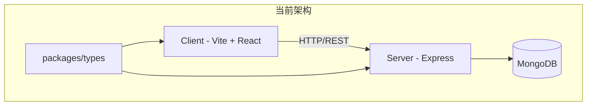
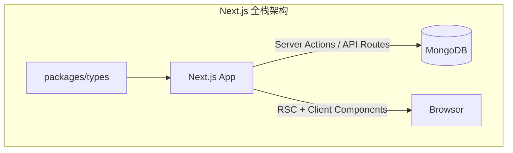

# Next.js 全栈架构迁移计划

## 项目背景

将当前的 Vite + React (CSR) + Express 独立后端架构迁移至 **Next.js 全栈架构**，为未来的 SSR（服务端渲染）做好准备。

### 当前架构概览



### 目标架构



---

## 项目分析总结

### 当前技术栈

| 层级     | 当前技术               | 迁移后技术                                    |
| -------- | ---------------------- | --------------------------------------------- |
| 前端框架 | Vite + React 19        | Next.js 14+ (App Router)                      |
| 路由     | React Router DOM       | Next.js File-based Routing                    |
| 样式     | TailwindCSS v4         | TailwindCSS v4 (postcss)                      |
| 状态管理 | Zustand                | Zustand (保留)                                |
| 数据获取 | TanStack Query + Axios | TanStack Query + fetch (SSR兼容)              |
| UI组件   | Radix UI + shadcn/ui   | Radix UI + shadcn/ui (保留)                   |
| 富文本   | TipTap                 | TipTap (保留)                                 |
| 后端     | Express + MongoDB      | Next.js API Routes / Server Actions + MongoDB |
| 认证     | JWT (localStorage)     | JWT + Cookies (SSR兼容)                       |

### 现有页面迁移映射

| 当前路由        | Next.js 路由                   | 页面类型            |
| --------------- | ------------------------------ | ------------------- |
| `/`             | `/app/page.tsx`                | 首页 (支持 SSR)     |
| `/login`        | `/app/login/page.tsx`          | 登录页              |
| `/profile`      | `/app/profile/page.tsx`        | 个人页              |
| `/post/:id`     | `/app/post/[id]/page.tsx`      | 帖子详情 (支持 SSR) |
| `/createPost`   | `/app/create-post/page.tsx`    | 创建帖子            |
| `/editPost/:id` | `/app/edit-post/[id]/page.tsx` | 编辑帖子            |

---

## User Review Required

> [!IMPORTANT]
> **虚拟滚动瀑布流组件 ([WaterfallContainer](file:///Users/nancy/Project/Frontend/TodayRedNote/client/src/components/WaterfallContainer.tsx#82-235))**
> 当前实现使用 `ResizeObserver` 和自定义二分查找进行虚拟化。Next.js 迁移后此组件可完全保留，因为它是纯客户端组件。**无需修改虚拟滚动逻辑**。

> [!IMPORTANT]
> **骨架屏 (`PostCardSkeleton`)**
> 骨架屏机制可完全保留，且在 SSR 场景下可通过 `loading.tsx` 提供更好的加载体验。

> [!WARNING]
> **认证迁移策略**
> 当前使用 `localStorage` 存储 JWT token，这在 SSR 场景下无法工作。迁移后需改用 HTTP-only Cookie 存储 token，以支持服务端渲染时的认证状态。这是一个**破坏性变更**。

> [!WARNING]
> **API 客户端改造**
> 当前使用 `axios` + `import.meta.env` 的方式在 Node.js 环境下不兼容。需要替换为 `fetch` API 并使用 `process.env` 获取环境变量。

---

## Proposed Changes

### Phase 1: 项目初始化与基础配置（根目录最终为 Next.js 项目）

> 目标：在不破坏现有 `client/`、`server/` 的前提下，用 `next-app/` 作为 **临时 Next.js 脚手架目录** 完成迁移工作，最后通过“扁平化步骤”把 `next-app/` 的内容整体上移到仓库根目录，使根目录成为唯一的 Next.js 应用入口。

#### 1.1 建立迁移分支与保护当前项目

- **创建迁移专用分支**（避免直接在主分支上大改）：

  ```bash
  # 在 TodayRedNote 仓库根目录
  git checkout -b feat/next-migration
  ```

- **标记当前目录结构**（方便后续对照和回滚）：
  - 当前关键目录：
    - `client/`：Vite + React 前端
    - `server/`：Express 后端
    - `packages/types/`：前后端共享类型
  - 后续迁移过程中，`client/` 与 `server/` 视为 **只读的“旧世界”代码**，所有新功能都在 `next-app/` 内实现，直到最终切换完成。

#### 1.2 在临时目录创建 Next.js 脚手架（next-app）

- 在 **仓库根目录** 下创建一个临时的 Next.js 应用目录 `next-app/`：

  ```bash
  # 在项目根目录执行（/TodayRedNote）
  npx create-next-app@latest next-app \
    --typescript \
    --tailwind \
    --eslint \
    --app \
    --src-dir \
    --import-alias "@/*" \
    --no-turbopack
  ```

- 命名说明：
  - 这里的 `next-app` 只是 **迁移期的工作目录名**，便于与你现有的 `client/`、`server/` 做区分；
  - 最终会在「Phase 8：根目录扁平化与遗留清理」中，将 `next-app/` 内的内容整体上移到仓库根目录，并删除 `client/`、`server/`、`next-app/` 等遗留结构；
  - 也可以根据喜好改成更语义化的名字（如 `web-next/`、`todayrednote-next/`），本方案以下统一以 `next-app/` 表述。

#### 1.3 将 next-app 接入现有 pnpm monorepo

- **确认 pnpm workspace 配置**：
  - 打开根目录 `pnpm-workspace.yaml`，在 `packages` 列表中新增 `next-app`（如果还没有）：

    ```yaml
    packages:
      - 'client'
      - 'server'
      - 'packages/*'
      - 'next-app'
    ```

- **让 Next 项目能够引用共享类型包**：
  - 在 `next-app/package.json` 中，增加对 `@today-red-note/types` 的依赖占位（具体安装在下一小节执行）：

    ```json
    {
      "dependencies": {
        "@today-red-note/types": "workspace:*"
      }
    }
    ```

- **统一使用 pnpm 命令**：
  - 后续在根目录执行脚本时，约定统一使用 pnpm，例如：

    ```bash
    pnpm install        # 在根目录安装所有 workspace 依赖
    pnpm --filter next-app dev
    ```

#### 1.4 在 next-app 中安装迁移所需依赖

**需要安装的依赖（在 `next-app/` 目录中执行）：**

```bash
cd next-app

# 核心依赖 (从 client/package.json 迁移)
pnpm add @hookform/resolvers @radix-ui/react-alert-dialog @radix-ui/react-dropdown-menu @radix-ui/react-label @radix-ui/react-slot @radix-ui/react-tabs @tanstack/react-query @tiptap/extension-link @tiptap/extension-placeholder @tiptap/pm @tiptap/react @tiptap/starter-kit class-variance-authority clsx lucide-react next-themes react-hook-form tailwind-merge zod zustand

# 后端依赖 (从 server/package.json 迁移)
pnpm add mongoose bcrypt jsonwebtoken cookie-parser ali-oss uuid openai

# 共享类型包（workspace 形式引用现有 packages/types）
pnpm add @today-red-note/types@workspace:*

# 开发依赖
pnpm add -D @types/bcrypt @types/jsonwebtoken @types/uuid tw-animate-css
```

**无需安装 (Next.js 内置或不再需要)：**

- ~~react-router-dom~~ (Next.js 内置路由)
- ~~axios~~ (使用 fetch)
- ~~vite~~ (使用 Next.js)
- ~~express~~ (使用 Next.js API Routes)
- ~~cors~~ (Next.js 内置处理)
- ~~morgan~~ (使用 Next.js 日志)

#### 1.5 为后续“根目录扁平化”预留约定

- **约定 1：迁移期间所有 Next 相关代码只放在 `next-app/` 下**，不再改动 `client/`、`server/`；
- **约定 2：Phase 2–7 完成页面与 API 迁移后，新增一个专门的「Phase 8：根目录扁平化与遗留清理」**，执行以下操作：
  - 停止旧的 Vite/Express 服务，仅保留 Next 开发服务器；
  - 将 `next-app/` 下的 `src/`、`public/`、`next.config.js`、`tailwind.config.*`、`tsconfig.*`、`package.json` 等文件整体移动到仓库根目录；
  - 合并根目录原有 `package.json` 与 `next-app/package.json` 中的脚本和依赖，保留 Next 所需配置；
  - 删除 `client/`、`server/`、`next-app/` 目录以及不再需要的 Vite、Express 相关配置文件；
  - 更新 `pnpm-workspace.yaml`，只保留 `packages/*`（以及必要的其他 workspace），让根目录直接作为 Next 应用。

---

### Phase 2: 目录结构迁移

#### 2.1 [NEW] Next.js App Router 目录结构

```
next-app/
├── src/
│   ├── app/                          # App Router
│   │   ├── layout.tsx                # 根布局 (替代 App.tsx 的 RootLayout)
│   │   ├── page.tsx                  # 首页 (从 HomePage.tsx 迁移)
│   │   ├── loading.tsx               # 首页加载状态 (骨架屏)
│   │   ├── login/
│   │   │   └── page.tsx              # 登录页
│   │   ├── profile/
│   │   │   └── page.tsx              # 个人页
│   │   ├── post/
│   │   │   └── [id]/
│   │   │       ├── page.tsx          # 帖子详情 (支持 SSR)
│   │   │       └── loading.tsx
│   │   ├── create-post/
│   │   │   └── page.tsx              # 创建帖子
│   │   ├── edit-post/
│   │   │   └── [id]/
│   │   │       └── page.tsx          # 编辑帖子
│   │   └── api/                       # API Routes (替代 Express routes)
│   │       ├── auth/
│   │       │   ├── login/route.ts
│   │       │   ├── register/route.ts
│   │       │   └── profile/route.ts
│   │       ├── posts/
│   │       │   ├── route.ts          # GET (列表)、POST (创建)
│   │       │   ├── mine/route.ts
│   │       │   └── [id]/
│   │       │       ├── route.ts      # GET、PUT、DELETE
│   │       │       ├── comments/route.ts
│   │       │       └── related/route.ts
│   │       ├── drafts/
│   │       │   └── route.ts
│   │       └── upload/
│   │           └── route.ts
│   ├── components/                    # 组件 (从 client/src/components 迁移)
│   │   ├── BottomNav.tsx
│   │   ├── PostCard.tsx
│   │   ├── PostCardSkeleton.tsx
│   │   ├── PostDetailItem.tsx
│   │   ├── WaterfallContainer.tsx    # 虚拟滚动 (保持不变)
│   │   ├── ui/                        # shadcn/ui 组件
│   │   └── editPost/
│   ├── hooks/                         # 自定义 Hooks (从 client/src/hooks 迁移)
│   ├── lib/                           # 工具函数
│   │   ├── api.ts                     # 改造为 fetch + cookies
│   │   ├── db.ts                      # MongoDB 连接 (新增)
│   │   ├── auth.ts                    # JWT 验证工具 (新增)
│   │   └── ...
│   ├── models/                        # Mongoose 模型 (从 server/src/models 迁移)
│   ├── services/                      # 业务逻辑 (从 server/src/services 迁移)
│   ├── stores/                        # Zustand stores (从 client/src/stores 迁移)
│   └── types/                         # 本地类型定义
├── public/                            # 静态资源
├── next.config.js
├── tailwind.config.ts
└── package.json
```

---

### Phase 3: 核心改造点

#### 3.1 [MODIFY] 认证系统迁移 (localStorage → Cookies)

**当前实现问题：**

- `localStorage.getItem('token')` 在服务端无法访问
- SSR 时无法获取用户认证状态

**改造方案：**

```typescript
// src/lib/auth.ts (新建)
import { cookies } from 'next/headers'
import jwt from 'jsonwebtoken'

const JWT_SECRET = process.env.JWT_SECRET!

export async function getServerSession() {
  const cookieStore = await cookies()
  const token = cookieStore.get('token')?.value

  if (!token) return null

  try {
    const decoded = jwt.verify(token, JWT_SECRET)
    return decoded as { userId: string; username: string }
  } catch {
    return null
  }
}

export function setAuthCookie(token: string) {
  return {
    'Set-Cookie': `token=${token}; HttpOnly; Secure; SameSite=Strict; Path=/; Max-Age=${7 * 24 * 60 * 60}`,
  }
}
```

#### 3.2 [MODIFY] API 客户端改造

```typescript
// src/lib/api.ts (改造)
class ApiClient {
  private baseUrl: string

  constructor() {
    this.baseUrl = process.env.NEXT_PUBLIC_API_URL || ''
  }

  async request<T>(endpoint: string, options: RequestInit = {}): Promise<T> {
    const url = `${this.baseUrl}${endpoint}`

    const response = await fetch(url, {
      ...options,
      headers: {
        'Content-Type': 'application/json',
        ...options.headers,
      },
      credentials: 'include', // 携带 cookies
    })

    if (!response.ok) {
      throw new Error(`API Error: ${response.status}`)
    }

    return response.json()
  }

  get<T>(endpoint: string) {
    return this.request<T>(endpoint)
  }

  post<T>(endpoint: string, data: unknown) {
    return this.request<T>(endpoint, {
      method: 'POST',
      body: JSON.stringify(data),
    })
  }

  put<T>(endpoint: string, data: unknown) {
    return this.request<T>(endpoint, {
      method: 'PUT',
      body: JSON.stringify(data),
    })
  }

  delete<T>(endpoint: string) {
    return this.request<T>(endpoint, { method: 'DELETE' })
  }
}

export const api = new ApiClient()
```

#### 3.3 [MODIFY] Zustand Store 改造 (SSR 兼容)

```typescript
// src/stores/auth.ts (改造)
import { create } from 'zustand'

type User = {
  _id: string
  username: string
  createdAt: string
}

type AuthState = {
  user: User | null
  isAuthenticated: boolean
  initialized: boolean
  setUser: (user: User | null) => void
  logout: () => void
  initialize: () => Promise<void>
}

export const useAuthStore = create<AuthState>(set => ({
  user: null,
  isAuthenticated: false,
  initialized: false,

  setUser: user =>
    set({
      user,
      isAuthenticated: !!user,
      initialized: true,
    }),

  logout: async () => {
    // 调用登出 API 清除服务端 cookie
    await fetch('/api/auth/logout', { method: 'POST' })
    set({ user: null, isAuthenticated: false })
  },

  initialize: async () => {
    try {
      const res = await fetch('/api/auth/profile')
      if (res.ok) {
        const data = await res.json()
        set({ user: data.user, isAuthenticated: true, initialized: true })
      } else {
        set({ user: null, isAuthenticated: false, initialized: true })
      }
    } catch {
      set({ user: null, isAuthenticated: false, initialized: true })
    }
  },
}))
```

#### 3.4 [NEW] MongoDB 连接

```typescript
// src/lib/db.ts (新建)
import mongoose from 'mongoose'

const MONGODB_URI = process.env.MONGODB_URI!

let cached = (global as any).mongoose || { conn: null, promise: null }

export async function connectDB() {
  if (cached.conn) return cached.conn

  if (!cached.promise) {
    cached.promise = mongoose.connect(MONGODB_URI)
  }

  cached.conn = await cached.promise
  return cached.conn
}
```

---

### Phase 4: 页面迁移详细步骤

#### 4.1 [MODIFY] 根布局 (layout.tsx)

```typescript
// src/app/layout.tsx
import type { Metadata } from 'next'
import { Inter } from 'next/font/google'
import './globals.css'
import { Providers } from '@/components/Providers'

const inter = Inter({ subsets: ['latin'] })

export const metadata: Metadata = {
  title: 'Today Red Note',
  description: '今日红书 - 分享你的精彩生活',
}

export default function RootLayout({
  children,
}: {
  children: React.ReactNode
}) {
  return (
    <html lang="zh-CN" suppressHydrationWarning>
      <body className={inter.className}>
        <Providers>
          <div className="flex min-h-screen justify-center bg-gray-100">
            <div className="relative w-full max-w-md min-h-screen bg-gray-100">
              {children}
            </div>
          </div>
        </Providers>
      </body>
    </html>
  )
}
```

#### 4.2 [NEW] Providers 组件

```typescript
// src/components/Providers.tsx
'use client'

import { QueryClient, QueryClientProvider } from '@tanstack/react-query'
import { ThemeProvider } from 'next-themes'
import { useState } from 'react'
import { ToastProvider } from '@/components/ui/toast'

export function Providers({ children }: { children: React.ReactNode }) {
  const [queryClient] = useState(
    () =>
      new QueryClient({
        defaultOptions: {
          queries: {
            staleTime: 1000 * 60 * 5,
            refetchOnWindowFocus: false,
          },
        },
      })
  )

  return (
    <QueryClientProvider client={queryClient}>
      <ThemeProvider attribute="class" defaultTheme="light">
        {children}
        <ToastProvider position="top-center" />
      </ThemeProvider>
    </QueryClientProvider>
  )
}
```

#### 4.3 [MODIFY] 首页 (支持 SSR 预渲染)

```typescript
// src/app/page.tsx
import { Suspense } from 'react'
import { HomePageClient } from '@/components/HomePageClient'
import { PostCardSkeleton } from '@/components/PostCardSkeleton'
import { connectDB } from '@/lib/db'
import Post from '@/models/postModel'

// 服务端获取初始数据
async function getInitialPosts() {
  await connectDB()
  const posts = await Post.find()
    .sort({ createdAt: -1 })
    .limit(20)
    .populate('author', 'username')
    .lean()

  return JSON.parse(JSON.stringify(posts)) // 序列化
}

export default async function HomePage() {
  const initialPosts = await getInitialPosts()

  return (
    <Suspense fallback={<HomePageSkeleton />}>
      <HomePageClient initialPosts={initialPosts} />
    </Suspense>
  )
}

function HomePageSkeleton() {
  return (
    <div className="flex w-full gap-1 px-1 py-1">
      <div className="flex flex-1 flex-col gap-1">
        {Array.from({ length: 4 }).map((_, i) => (
          <PostCardSkeleton key={`left-${i}`} />
        ))}
      </div>
      <div className="flex flex-1 flex-col gap-1">
        {Array.from({ length: 4 }).map((_, i) => (
          <PostCardSkeleton key={`right-${i}`} />
        ))}
      </div>
    </div>
  )
}
```

#### 4.4 [MODIFY] 帖子详情页 (支持 SSR)

```typescript
// src/app/post/[id]/page.tsx
import { notFound } from 'next/navigation'
import { PostDetailClient } from '@/components/PostDetailClient'
import { connectDB } from '@/lib/db'
import Post from '@/models/postModel'
import { Metadata } from 'next'

interface Props {
  params: { id: string }
}

// 动态生成 SEO 元数据
export async function generateMetadata({ params }: Props): Promise<Metadata> {
  await connectDB()
  const post = await Post.findById(params.id).populate('author', 'username')

  if (!post) return { title: '帖子未找到' }

  return {
    title: `${post.title} - ${post.author.username}`,
    description: post.bodyPreview || post.title,
    openGraph: {
      title: post.title,
      description: post.bodyPreview,
      images: post.images?.[0] ? [post.images[0]] : [],
    },
  }
}

export default async function PostDetailPage({ params }: Props) {
  await connectDB()
  const post = await Post.findById(params.id)
    .populate('author', 'username')
    .lean()

  if (!post) notFound()

  return <PostDetailClient post={JSON.parse(JSON.stringify(post))} />
}
```

---

### Phase 5: API Routes 迁移

#### 5.1 [NEW] 帖子列表 API

```typescript
// src/app/api/posts/route.ts
import { NextRequest, NextResponse } from 'next/server'
import { connectDB } from '@/lib/db'
import Post from '@/models/postModel'
import { getServerSession } from '@/lib/auth'

export async function GET(request: NextRequest) {
  await connectDB()

  const { searchParams } = new URL(request.url)
  const cursor = searchParams.get('cursor')
  const limit = parseInt(searchParams.get('limit') || '20')
  const excludeIds = searchParams.get('excludeIds')?.split(',') || []

  const query: any = {}
  if (cursor) {
    query._id = { $lt: cursor }
  }
  if (excludeIds.length > 0) {
    query._id = { ...query._id, $nin: excludeIds }
  }

  const posts = await Post.find(query)
    .sort({ createdAt: -1 })
    .limit(limit + 1)
    .populate('author', 'username')
    .lean()

  const hasNextPage = posts.length > limit
  const items = hasNextPage ? posts.slice(0, -1) : posts

  return NextResponse.json({
    posts: items,
    nextCursor: hasNextPage ? items[items.length - 1]._id : null,
    hasNextPage,
  })
}

export async function POST(request: NextRequest) {
  const session = await getServerSession()
  if (!session) {
    return NextResponse.json({ error: 'Unauthorized' }, { status: 401 })
  }

  await connectDB()
  const body = await request.json()

  const post = await Post.create({
    ...body,
    author: session.userId,
  })

  return NextResponse.json({ post }, { status: 201 })
}
```

---

### Phase 6: 需要保留的组件 (无需修改)

以下组件可直接迁移，只需添加 `'use client'` 指令：

| 组件                                                                                                                             | 原因                 |
| -------------------------------------------------------------------------------------------------------------------------------- | -------------------- |
| [WaterfallContainer.tsx](file:///Users/nancy/Project/Frontend/TodayRedNote/client/src/components/WaterfallContainer.tsx)         | 虚拟滚动纯客户端逻辑 |
| [PostCard.tsx](file:///Users/nancy/Project/Frontend/TodayRedNote/client/src/components/PostCard.tsx)                             | UI组件               |
| [PostCardSkeleton.tsx](file:///Users/nancy/Project/Frontend/TodayRedNote/client/src/components/PostCardSkeleton.tsx)             | UI组件               |
| [PostDetailItem.tsx](file:///Users/nancy/Project/Frontend/TodayRedNote/client/src/components/PostDetailItem.tsx)                 | 富文本渲染           |
| [BottomNav.tsx](file:///Users/nancy/Project/Frontend/TodayRedNote/client/src/components/BottomNav.tsx)                           | 导航组件             |
| [PullToRefreshIndicator.tsx](file:///Users/nancy/Project/Frontend/TodayRedNote/client/src/components/PullToRefreshIndicator.tsx) | 交互组件             |
| [PublishingBanner.tsx](file:///Users/nancy/Project/Frontend/TodayRedNote/client/src/components/PublishingBanner.tsx)             | 状态展示             |
| `ui/*`                                                                                                                           | shadcn/ui 组件       |
| `editPost/*`                                                                                                                     | 编辑器组件           |

---

### Phase 7: 需要删除的代码

| 位置                                                                                             | 原因                              |
| ------------------------------------------------------------------------------------------------ | --------------------------------- |
| [client/src/lib/api.ts](file:///Users/nancy/Project/Frontend/TodayRedNote/client/src/lib/api.ts) | 用新的 fetch 客户端替代           |
| [client/src/App.tsx](file:///Users/nancy/Project/Frontend/TodayRedNote/client/src/App.tsx)       | 路由逻辑移至 Next.js 文件系统路由 |
| [client/src/main.tsx](file:///Users/nancy/Project/Frontend/TodayRedNote/client/src/main.tsx)     | 入口逻辑移至 layout.tsx           |
| [client/vite.config.ts](file:///Users/nancy/Project/Frontend/TodayRedNote/client/vite.config.ts) | 使用 next.config.js               |
| `server/*`                                                                                       | 全部迁移至 Next.js API Routes     |

---

## Verification Plan

### Automated Tests

由于项目中目前没有发现自动化测试文件，建议迁移后添加：

```bash
# 安装测试依赖
pnpm add -D jest @testing-library/react @testing-library/jest-dom

# 运行构建验证
pnpm run build

# 启动开发服务器验证
pnpm run dev
```

### Manual Verification

1. **首页加载验证**
   - 访问 `http://localhost:3000`
   - 验证瀑布流正常渲染
   - 禁用 JavaScript 后刷新，确认 SSR 生效（页面内容仍然显示）

2. **认证流程验证**
   - 登录并检查 cookie 是否正确设置
   - 刷新页面确认登录状态保持
   - 新开隐私窗口确认未登录状态

3. **帖子详情 SSR 验证**
   - 访问 `/post/[id]`，查看页面源代码确认内容已预渲染
   - 检查 `<title>` 和 `og:` 标签是否正确生成

---

## 迁移检查清单 (TODO)

### Phase 1: 项目初始化

- [ ] 使用 create-next-app 创建新项目
- [ ] 安装所有必要依赖
- [ ] 配置 pnpm workspace 引用 types 包
- [ ] 配置 TailwindCSS v4 (postcss 方式)
- [ ] 配置 shadcn/ui

### Phase 2: 核心基础设施

- [ ] 创建 MongoDB 连接工具 (`lib/db.ts`)
- [ ] 迁移 Mongoose 模型 (8个模型)
- [ ] 创建服务端认证工具 (`lib/auth.ts`)
- [ ] 改造 API 客户端 (axios → fetch)
- [ ] 改造 Zustand stores (SSR兼容)

### Phase 3: API Routes 迁移

- [ ] `/api/auth/*` (login, register, profile, logout)
- [ ] `/api/posts/*` (CRUD, comments, related)
- [ ] `/api/drafts/*`
- [ ] `/api/upload/*`

### Phase 4: 页面迁移

- [ ] 根布局 (`layout.tsx`) + Providers
- [ ] 首页 (`page.tsx`) + SSR 数据获取
- [ ] 登录页 (`login/page.tsx`)
- [ ] 个人页 (`profile/page.tsx`)
- [ ] 帖子详情页 (`post/[id]/page.tsx`) + SSR + 动态元数据
- [ ] 创建帖子页 (`create-post/page.tsx`)
- [ ] 编辑帖子页 (`edit-post/[id]/page.tsx`)

### Phase 5: 组件迁移

- [ ] 添加 `'use client'` 到所有客户端组件
- [ ] 迁移 WaterfallContainer (虚拟滚动)
- [ ] 迁移 PostCard + PostCardSkeleton
- [ ] 迁移 PostDetailItem (TipTap 渲染)
- [ ] 迁移 BottomNav
- [ ] 迁移 ui/\* 组件
- [ ] 迁移 editPost/\* 组件

### Phase 6: Hooks 迁移

- [ ] useCreatePost, useUpdatePost, useDeletePost
- [ ] useDraftAutoSave
- [ ] useImageSelection
- [ ] usePullToRefresh
- [ ] 其他 hooks

### Phase 7: 服务层迁移

- [ ] postService
- [ ] aiService
- [ ] storageService (阿里云 OSS)
- [ ] userProfileService
- [ ] tagService, topicService
- [ ] commentService, draftService

### Phase 8: 验收测试

- [ ] 本地开发环境验证所有功能正常
- [ ] SSR 验证 (禁用 JS 后页面仍可读)
- [ ] 生产构建验证 (`pnpm run build`)
- [ ] 部署测试

---

## 时间估算

| 阶段                  | 预计时间       |
| --------------------- | -------------- |
| Phase 1: 项目初始化   | 2-3 小时       |
| Phase 2: 核心基础设施 | 4-6 小时       |
| Phase 3: API Routes   | 8-10 小时      |
| Phase 4: 页面迁移     | 6-8 小时       |
| Phase 5-6: 组件+Hooks | 4-6 小时       |
| Phase 7: 服务层       | 4-6 小时       |
| Phase 8: 测试与修复   | 4-6 小时       |
| **总计**              | **32-45 小时** |

---

## 环境变量配置

```env
# .env.local (Next.js)
MONGODB_URI=mongodb+srv://...
JWT_SECRET=your-jwt-secret
NEXT_PUBLIC_API_URL=http://localhost:3000/api

# 阿里云 OSS
ALI_ACCESS_KEY_ID=...
ALI_ACCESS_KEY_SECRET=...
ALI_OSS_BUCKET=...
ALI_OSS_REGION=...

# OpenAI
OPENAI_API_KEY=...
```
